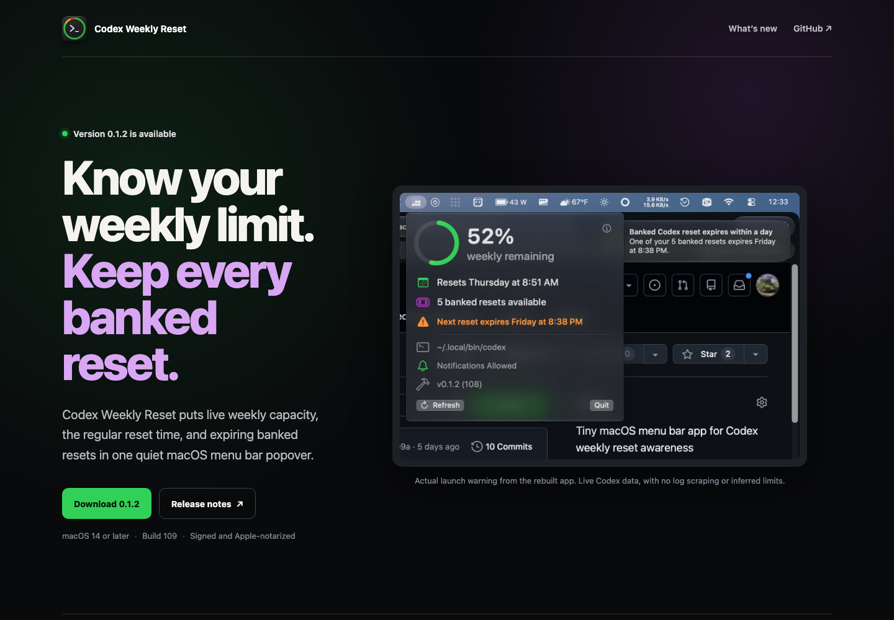

# Codex Weekly Reset

A native macOS menu bar app for seeing how much weekly Codex capacity remains, when the regular reset happens, and whether a banked reset is about to expire.



It stays in the menu bar with a small status ring and your remaining weekly percentage. Open the popover for the regular reset time, available banked resets, and the next banked-reset expiry.

Notifications cover the moments worth interrupting you for: low capacity, an exhausted limit, restored capacity, and a banked reset that will expire in one day or one hour.

The app reads the live Codex app-server response instead of inferring limits from logs or old snapshots. If that read fails, it says so instead of showing a stale number.

This is an independent utility. It is not affiliated with, endorsed by, or supported by OpenAI.

## Download

[**Download Codex Weekly Reset 0.1.2 (build 109)**](https://github.com/macintog/codex-weekly-reset/releases/download/v0.1.2/CodexWeeklyReset.zip)

Requires macOS 14 or later. The release app is Developer ID signed, Apple-notarized, and stapled. See the [0.1.2 release notes](https://github.com/macintog/codex-weekly-reset/releases/tag/v0.1.2).

## What’s New in 0.1.2

- **Banked resets at a glance.** See the available count and next expiry beside the regularly scheduled weekly reset.
- **Warnings before a reset expires.** The expiry row turns amber within 24 hours and red within one hour, with a macOS notification at each threshold.
- **A clearer popover.** Quota and reset information lead the hierarchy; source, notification, and build details remain available without competing for attention.
- **Reliable reporting with current Codex releases.** Weekly capacity and reset timing load from the current live response format.

## Run

```bash
./script/build_and_run.sh
```

Useful modes:

```bash
./script/build_and_run.sh --verify
./script/build_and_run.sh --logs
./script/build_and_run.sh --telemetry
./script/build_and_run.sh --developer-id
```

`--developer-id` stages the app without launching it and signs it with the Developer ID identity provided in `CODEX_WEEKLY_RESET_DEVELOPER_ID_APPLICATION_IDENTITY`.

## Test

```bash
swift test
```

Fixture mode is available for deterministic UI checks:

```bash
CODEX_WEEKLY_RESET_FIXTURE=/path/to/rate-limits.json ./script/build_and_run.sh --verify
```

## Public Surface

- `Sources/CodexWeeklyReset`: app implementation
- `Tests/CodexWeeklyResetTests`: behavior tests
- `Resources/AppIcon.iconset`: icon source
- `script/build_and_run.sh`: local build, bundle, sign, and launch helper
